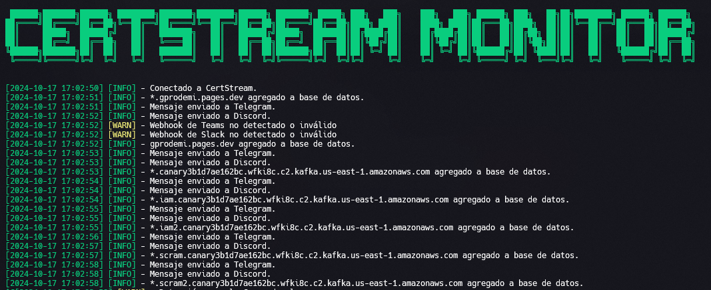
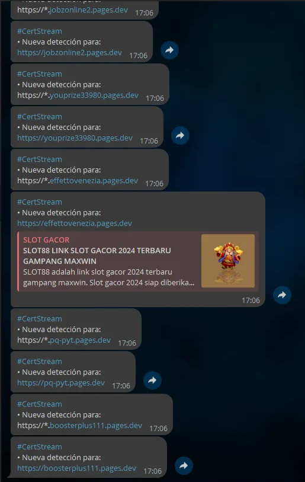

<p align="center">

---

# • CertStream Monitor

CertStream Monitor es una herramienta para monitorear y registrar eventos de CertStream ([calidog.io](https://calidog.io)), que proporciona información en tiempo real sobre cambios en los certificados TLS/SSL. Este proyecto utiliza `websockets` para conectarse al flujo de datos y registrar la información en un archivo de log.

## • Características

- Conexión en tiempo real a CertStream
- Filtrado de registros según dominios y conjunto de caracteres
- Base de datos SQLite para almacenamiento de datos
- Envío de notificaciones a Slack, Microsoft Teams, Telegram, y Discord
- Registro de eventos en un archivo `.log`

## • Capturas

<p align="center">
<p align="center">

## • Requisitos

Antes de ejecutar el proyecto, asegúrate de tener instalado lo siguiente:

- Python 3.9 o superior
- pip

## • Instalación

### • Uso Directo

1. **Clona este repositorio**:
    
    ```bash
    git clone https://github.com/jheeree/certstream_monitor
    cd certstream_monitor
    ```
    
2. **Instala las dependencias:**
    
    ```
    pip install -r requirements.txt
    ```
    
3. **Editar archivo de configuración `config.ini` en base a donde quieres recibir las notificaciones:**
    
    ```python
    [telegram]
    api_key = # TOKEN
    chat_id = # Grupo, Canal, o Usuario
    
    [discord]
    webhook_url = # URL
    
    [teams]
    webhook_url = # URL
    
    [slack]
    webhook_url = # URL
    
    [app]
    filtros = # Dominios y caracteres separados por , ejemplo: .google.com, .uber.com, linkedin, site-123
    ```
    
4. **Ejecución del script:**
    
    ```bash
    python CertStream_Monitor.py
    ```
    

### • Uso con Docker 🐳

1. **Asegúrate de tener Docker y Docker Compose instalados**.
2. **Clona este repositorio** (si no lo has hecho ya):
    
    ```bash
    git clone https://github.com/jheeree/certstream_monitor
    cd certstream_monitor
    ```
    
3. **Editar archivo de configuración `config.ini` en el mismo directorio que el archivo `docker-compose.yml`:**
    
    ```python
    [telegram]
    api_key = # TOKEN
    chat_id = # Grupo, Canal, o Usuario
    
    [discord]
    webhook_url = # URL
    
    [teams]
    webhook_url = # URL
    
    [slack]
    webhook_url = # URL
    
    [app]
    filtros = # Dominios y caracteres separados por , ejemplo: .google.com,.uber.com,linkedin,site-123
    ```
    
4. **Construye y ejecuta el contenedor**:
    
    ```bash
    docker compose build
    docker compose up -d
    ```
    
5. **Accede a los archivos de log y base de datos** 
    
    Los archivos generados (`certstream_data.log` y `certstream_data.sqlite`) estarán en el mismo directorio donde se ejecutó el comando, debido a la configuración de volúmenes en `docker-compose.yml`.
    

## •Contribuciones

Las contribuciones son bienvenidas! Si deseas mejorar este proyecto, no dudes en abrir un problema o enviar un pull request 😁
